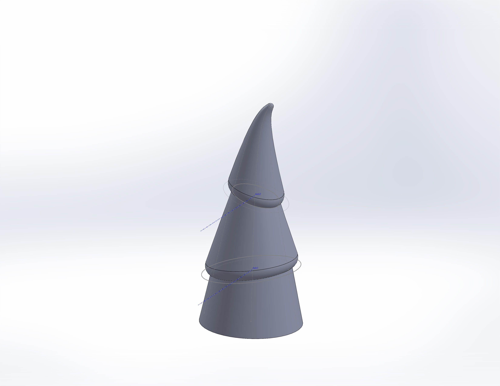
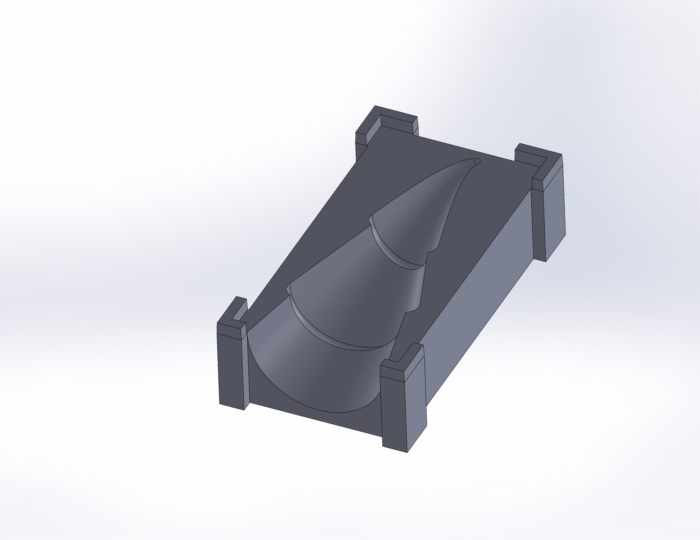

Concrete is one of my favorite building materials. It's long-lasting, looks and feels great, and is so very cheap. The typical process to make molds for casting, however, is laborious and can be expensive depending on the materials.

For this project, I wanted to see if I could print a 2-piece mold directly. In previous experiments, I 3D printed the object, smoothed and sealed it, then created a silicone mold. This process worked well, but the result didn't justify the time and cost to create the silicone mold.

To make the trees, I started with a SolidWorks model of the end result. This was created using several lofts between circles sketched on different planes.

I then created a model for the mold using the "Combine" and "Split" features in SolidWorks.

After both mold pieces were printed, I sealed them with a little silicone caulk and coated their surface with a little oil to help the cast separate from the mold. I tried a few different materials for the trees, including RapidSet CementAll, plaster, and a fast-setting QuickCrete product. The plaster was very easy to work with and sands well, but I didn't like the look and finish as much as the CementAll variants. Green pigment powder worked well with the light gray concrete, creating a subtle effect.

As you can tell in the image above, the tip of the tree was a little too sharp for this material. While I tried to keep the mix as dry as possible for strength, the tip cracked on all but a few of the trees when I demolded them.
