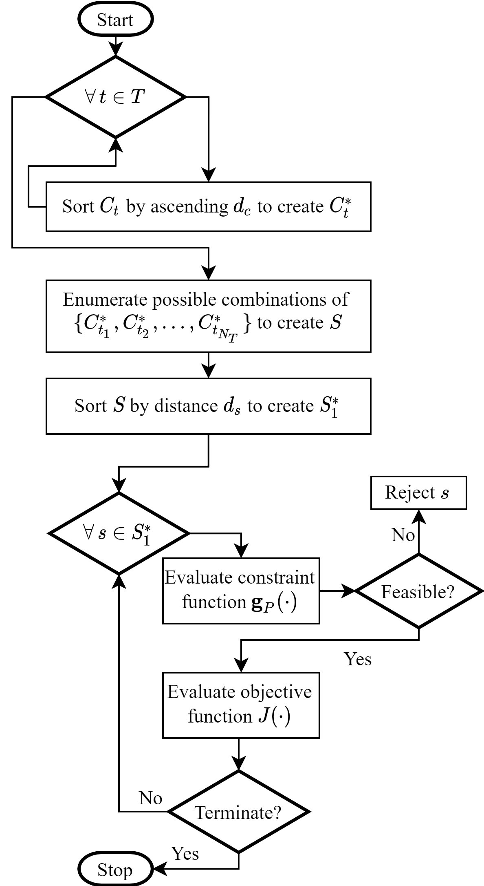

This research emerged from a gap between system design practice and the optimization tools available to support it.

The practice has adapted in to meet ever-increasing performance and efficiency demands. Systems became more complex, requiring engineering companies and their design engineers to specialize. And with specialization came component encapsulation. Instead of building components specifically for a system, companies purchase components from suppliers and integrate them into the system.  This can drastically reduce development time and cost.

But existing optimization tools support clean-sheet system design. Given a system model, they tune continuous parameters to return a set of optimal parameter values. When building components from scratch, they can be designed to match the prescribed parameters. But if you want to source components from suppliers, the best you can do is select components that are close to the optimal values. This can lead to suboptimal results, especially if you are choosing among relatively few components or if the components are tightly coupled (that is, the selection for one component influences the best choice for another component).

For my graduate work, I put together some tools and algorithms to facilitate this component-based design practice. The optimization process starts with a system model and a database of components to choose from. Then, surrogate models are used to obtain a continuous parameterization of the components in the database, which yields a continuous-domain representation of the discrete selection problem. Using efficient, gradient-based optimization algorithms, the continuous representation is solved to obtain a set of optimal parameters. Finally, a discrete search algorithm is used to search for components near the optimal parameters to obtain a solution to the original, discrete selection problem.

We applied the process to select components that maximize the dynamic performance of a ficticious planar (i.e. 2D) quadrotor. In the video below, the red path represents the initial design and the green path represents the optimized design.

`youtube: https://youtu.be/MA3Y_69mwxA`

I encourage you to check out my thesis or conference papers for more details!
