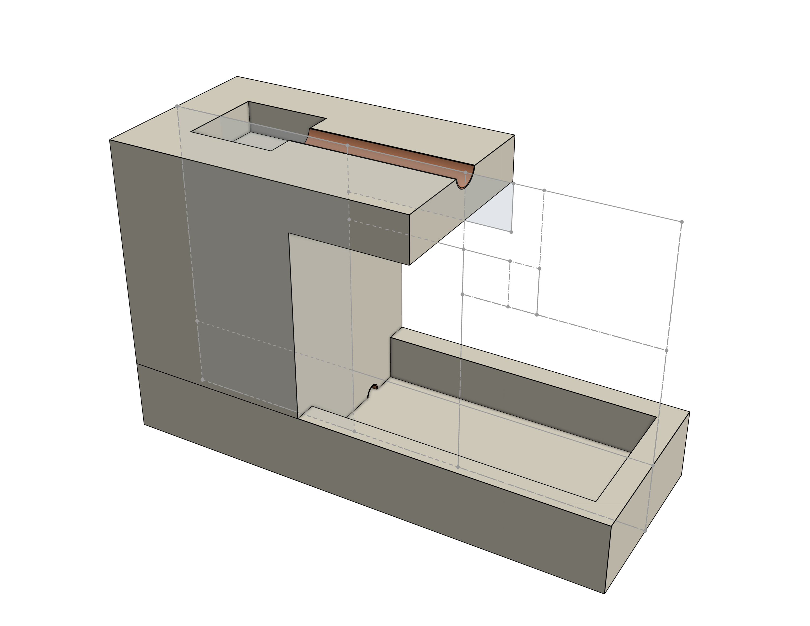
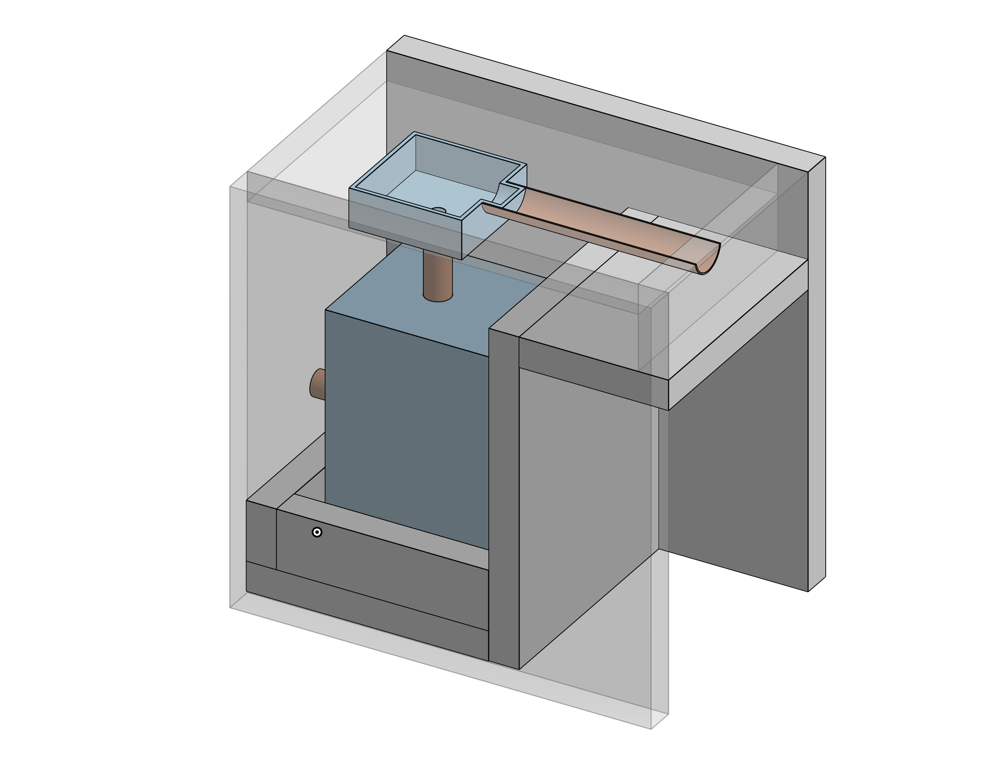
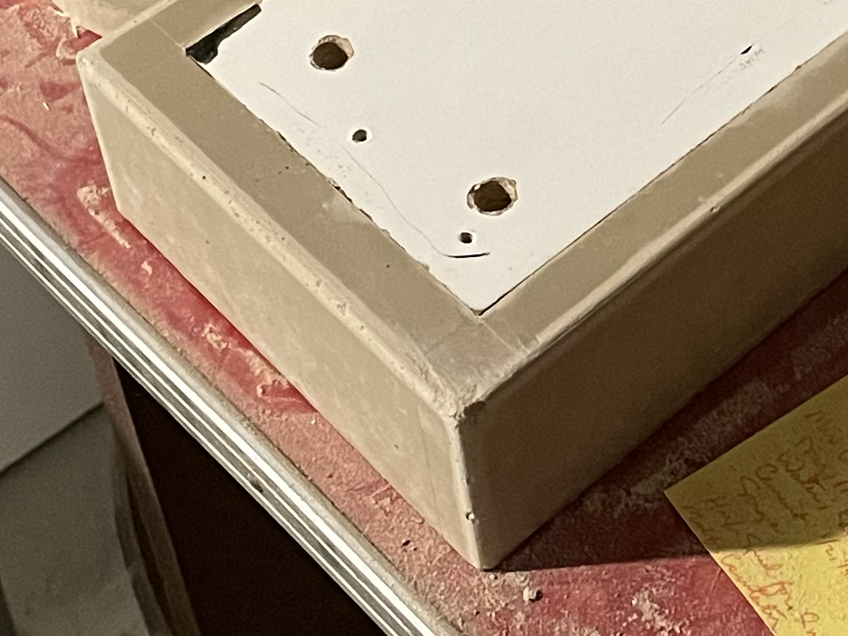

Whenever I'm tempted to trust in my inner *Homo economicus*, I can look back on this project as a reminder of just how readily reason defects to the service of *Homo ludens* and *Homo faber*. Why would I spend $20 to buy a fountain for the family cat *when I could make one instead*? Several months and more than $20 later, reason's duplicity was painfully apparent. 

I was fresh off Jeff Girard's "Creative Concrete Mastery" class and was itching to give my new GFRC skills a spin. A cat fountain happened to win my wife's approval for more night and weekend time in the "shop" (a corner of our basement). Inspired by Caleb Lawson's work with mixed materials, I wanted to try a design with exposed metal. The fountain's shape was determined largely by the casting forms that I could construct with limited tools and talent. Oblique angles were out, requiring bevel cuts with an accuracy beyond the reach of my makeshift track saw. The result was a simple, semi-brutalist design befitting the little feline tyrant for whom it was conceived. 

*OnShape CAD drawing of the concept*
  

The upper casting form consisted of a melamine shell and a handful of 3D-printed components. A part printed with flexible TPU filament created the visible pocket on top and helped to align the copper pipe. The flexible filament made it easy to remove the part from the cured concrete. I used good-old PLA for the part forming the pump cavity, since it could be left in place. This part also had holes for the water inlets, water outlet, and power cord. The lower casting form was a melamine shell with two stacked melamine rectangles creating the water reservoir. Since I couldn't build a form with a proper draft angle, removing the melamine knock-out took some time and effort. I made a bunch of parallel cuts with the Skill saw, then soaked the piece in water. This softened the remaining melamine enough to chisel it out without damaging the concrete. 

*Upper form assembly*
  

The concrete itself is white cement mixed with premium silica sand, Integrity PowerPack, Integrity glass fibers, and a healthy dose of Integrity UltraFlow superplasticizer to make a flowable mix. An old Milwaukee Hole Hawg with a mixing paddle worked well for small batches, but I do have my eyes out for a second-hand Collomix. 
  
A few lessons learned in the making: 
- For building forms, it's well worth taking the time to calibrate the cutting so that the angles are true. Small inaccuracies can quickly add up. 
- Allow the silicone to cure completely before casting. I accidently used a GE product that took seven days to fully cure instead of the expected 24 hours. This made it much harder to remove excess silicone from the form and seemed to cause some discoloration in the edges of the finished piece. 
- Embedded parts need a lot of mechanical bite to adhere to the concrete. I thought scratching the bottom surface of the pipe with a file would give it enough texture, but the pipe easily popped out when demolding. I should have glued on some strips to lock it in place. 

*Edge discoloration from uncured silicone*
  

When pressed to procure a feline-friendly fountain, *Homo Economicus* should have jumped at the opportunity to spend $20 at Target. But for the lessons learned, skills practiced, and joy of making for its own sake, I'm glad he didn't. 

