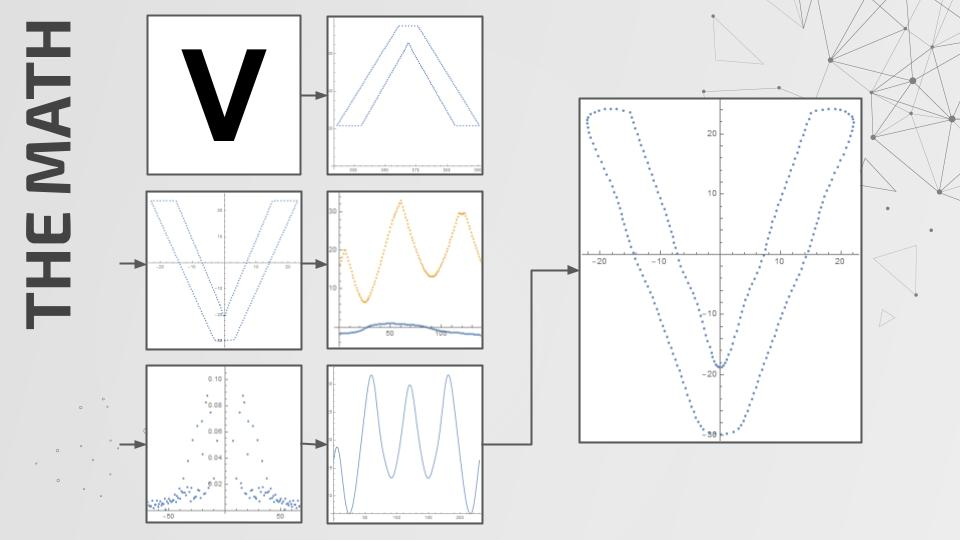
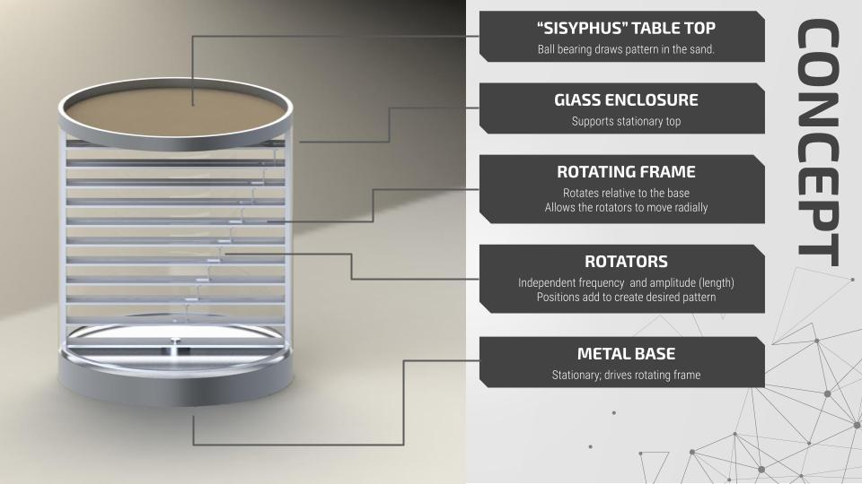
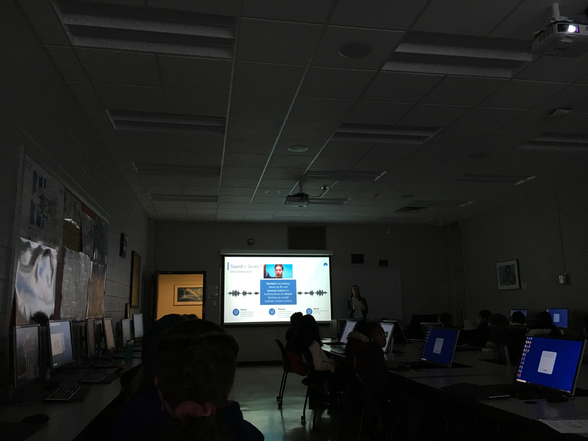

## Epicycle Visualization

## Kinetic Sculpture

## USTEP Class
I got the chance to share what I learned about Fourier Series with a group of middle school students throught the "University Student Taught Engineering Program" at UVA.  The 'big idea' of the workshop revolves around mathematical series: we can approximate almost anything with a series of enough terms.  Here's the workshop's description

 >Ever wonder how Shazam identifies songs, how image and audio files are built, or how audio equalizers can boost the bass or other frequencies in music?  Back in 1807, Mr. Jean-Baptiste Joseph Fourier figured out that any signal can be filtered into a bunch of circular paths.  Today, we see these “Fourier Series” used everywhere from audio and image processing to describing how heat flows through an object.  They can even convert your signature into a formula!  With animations and hands-on demos, this class will show you how Fourier Series work and how it’s used in the real world without any crazy math getting in the way.

 The cool thing is that we can take simple ideas, like spinning circles, and combine them to make things that are complex and beautiful.  Really, this is how all of science and technology works. Our knowledge about how the world works is built out of a bunch of simple discoveries that have added up to the understanding we have today.	The invention of the automobile started with the discovery of the wheel…

 
