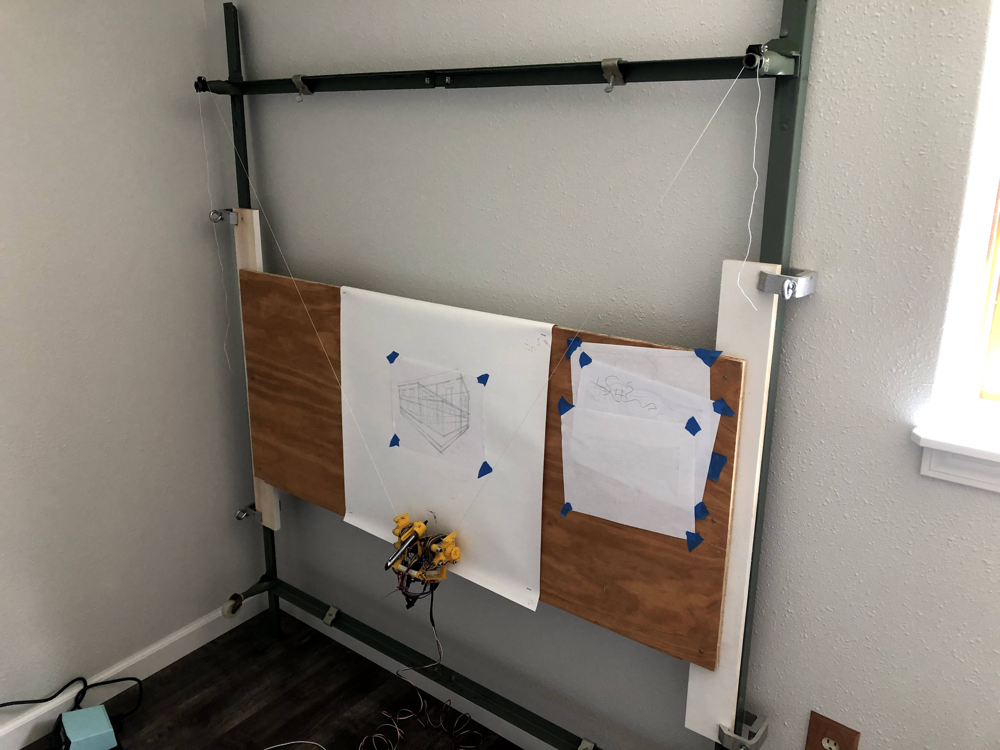

This wall plotter was my quaranteen project. At the time I was fascinated by cable-driven robots, since through clever design and controls they can be much less expensive and traverse a much larger area than other motion platforms. Most DIY v-plotters have motors at the upper corners of the drawing surface which control the pen carriage.

I opted for a different approach with all of the electronics in one tight package like the commercially available [Scribit](https://scribit.design/) robot. This design makes the system more portable, easier to install, and minimizes wires. However, the additional weight requires more torque from the actuators. Also, because the two cables making the "V" do not perfectly converge at the pen location, the math to calculate the position becomes a bit more complicated.  Currently, the system operates in a 'quasi-static' state that prevents the robot from swinging from side to side.  I would love to spend some more time on the system dynamics and control at some point.

The project is far from polished, but it was a great introduction to the theory and practice of cable-actuated robotics.

Can we handle changes to?